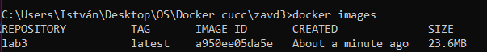
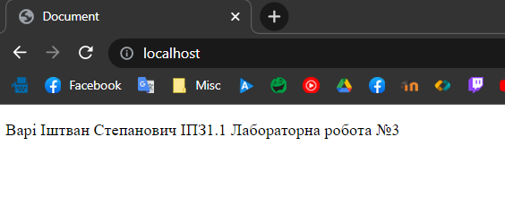
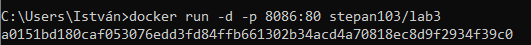
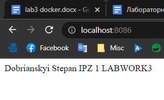


**Державний вищий навчальний заклад 
Ужгородський національний університет 
Факультет інформаційних технологій**

**ЛАБОРАТОРНА РОБОТА № 3**

**Тема:** Docker

Виконав студент ІII курсу
Напрям: «Інженерія програмного забезпечення» 
Варі Іштван Степанович

**Хід роботи**

План:

1) Використання готових Docker Images.
1) Використання Docker Compose.
1) Створення HTML сторінки та занесення її в Docker Image. Залити даний Docker Image на Docker Hub.
1) Скачати Docker Image когось із групи і розвернути в себе контейнер з HTML сторінкою на порті 8086 ззовні.

---

1. Використання готових Docker Images.

Я зробив pull wordpress

Створив файл stack.yml із налаштуваннями wordpress із dockerhub

Виконав команду docker compose up який будує image

docker-compose -f stack.yml up

Сайт wordpress на http://localhost:8080/

**2. Використання Docker Compose.**

Docker Compose — це інструмент для запуску багатоконтейнерних програм на Docker, визначених за допомогою формату файлу Compose. Файл Compose використовується для визначення того, як налаштовано один або кілька контейнерів, які складають вашу програму. Отримавши файл Compose, ви можете створити та запустити програму за допомогою однієї команди: docker compose up.

Docker-compose.yml — це файл конфігурації для Docker Compose.

Візьмемо, наприклад, простий веб-додаток: вам потрібен сервер, база даних і PHP. Тож ви можете встановити три контейнери докерів із Apache2, PHP і MySQL.

Перевагою Docker Compose є легке налаштування. Вам не потрібно писати велику купу команд у Bash. Ви можете попередньо визначити його в docker-compose.yml:

Переваги формату YAML:

- Він більш зрозумілий людині. YAML дозволяє представляти складні структури даних у зручному для читання форматі.
- Має строгий синтаксис. Специфікація YAML має мінімальний простір для гнучкості, що підвищує її надійність.
- YAML є потужнішим, ніж JSON, коли справа доходить до визначення складних структур даних. Це надмножина JSON, що означає, що всі дійсні документи JSON також є дійсними YAML.

Недоліки формату YML:

- YAML в основному призначений для налаштування під час використання для обміну даними, багато функцій YAML втрачають свою привабливість.
- Обробка файлів yaml для комп’ютера складніша і зазвичай не підтримується мовами програмування нативно

**3. Створення HTML сторінки та занесення її в Docker Image.**

Я створив html документ і Dockerfile

Виконав docker build для будування image

Готовий image:

Запустив image через команду:

docker run -d -p 80:80 lab3

Вигляд запущеної сторінки

Дальше я створив репозиторій на Dockerhub

<https://hub.docker.com/repository/docker/istvanvari/lab3>

Зробив логін через термінал

Додав tag до docker image і виконав docker push у репозиторій

Репозиторій після push:

**4. Скачати Docker Image когось із групи і розвернути в себе контейнер з HTML сторінкою на порті 8086 ззовні.**

https://github.com/stepandobr/labworks/blob/lab3/lab3/Lab3-dobrianskyi.md

docker pull stepan103/lab3

docker run -d -p 8086:80 stepan103/lab3

<https://hub.docker.com/repository/docker/istvanvari/lab3>

